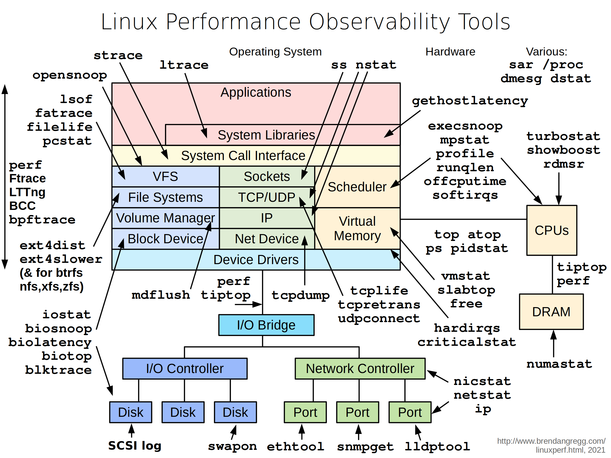

# k8sdebugger
A containerized toolbox for debugging kubernetes

## Build and push k8sdebugger image
```shell
docker buildx build --platform linux/amd64,linux/arm64 -f docker/k8sdebugger.Dockerfile -t dengliu/k8sdebugger:latest --push .
```

## Network Problems

Many network issues could result in application performance degradation. Some of those issues could be related to the underlying networking infrastructure(underlay). Others could be related to misconfiguration at the host or Docker level. Let's take a look at common networking issues:

- latency 
- routing
- DNS resolution
- firewall
- incomplete ARPs

k8sdebugger offers a set of tools as recommended by this diagram


